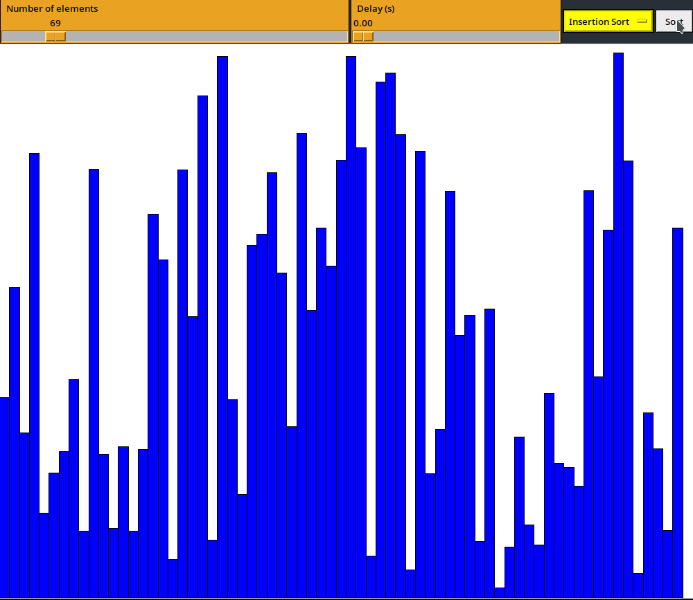

# Sorting Visualizer

This is a Sorting Visualizer program that displays a graphical representation of various sorting algorithms. It was implemented using Python's `tkinter` library for the GUI and allows the user to visualize: 
- Bubble sort
- Selection sort
- Insertion sort

## Getting Started

### Prerequisites
- Python 3.6 or later
- Tkinter library

### Usage

1. Open the terminal and navigate to the directory where the program is saved.
2. Run the program by typing:
`python main.py`
3. A window will pop up displaying the program's user interface.
4. Use the slider to choose the number of elements you want to sort.
5. Use the delay slider to adjust the delay between each comparison.
6. Select a sorting algorithm from the dropdown menu.
7. Click on the "Sort" button to visualize the sorting algorithm.

# Submitted by:
<strong>1. Aashish Pokharel (01), BCT A </strong>
<strong>2. Aashutosh Joshi (02), BCT A </strong>
<strong>3. Ayush Acharya (21), BCT A </strong>

# Acknowledgments
This project was heavily inspired by [15 Sorting Algorithms in 6 Minutes](https://youtu.be/kPRA0W1kECg) - [Timo Bingmann](https://www.youtube.com/@TimoBingmann)
